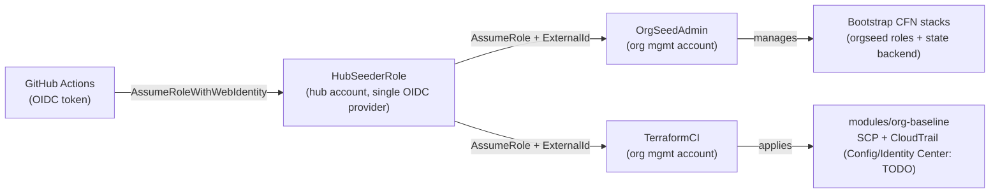

# aws-orgseed

[](https://github.com/DustyStudy/aws-orgseed/actions/workflows/validate.yml)

Multi-org AWS account seeding via Terraform, bootstrapped with OIDC — no long-lived
credentials, no per-org identity provider sprawl.

## The problem

Terraform can't manage an AWS Organization until an IAM role trusted by your CI's
OIDC provider already exists in that org's management account. But you can't create
that role *with* Terraform, because you have no credentials yet. `aws-orgseed` solves
this two-phase bootstrap problem across an arbitrary number of orgs from one config
file and one CI pipeline.

## Architecture: hub-and-spoke OIDC

Instead of creating a GitHub OIDC identity provider in every org (N providers to
maintain, N trust policies to audit), `aws-orgseed` uses one hub account:



Each org's `OrgSeedAdmin`/`TerraformCI` trust only the hub role's ARN, further
scoped by a per-org `sts:ExternalId` (confused-deputy protection — see
`bootstrap/org-seeding-role.yaml`). `TerraformCI` is explicitly denied any IAM
action on either role or CloudFormation action on the bootstrap stacks, so it
can never widen its own permissions even if its guardrail-baseline policy is
broadened later.

**Phase 0 — bootstrap (CloudFormation).** Run once per org, using whatever initial
admin access you have (break-glass, root, or credentials from `orgctl`). Deploys:
<<<<<<< HEAD
<<<<<<< HEAD
- `OrgSeedAdmin` role — scoped to managing the two bootstrap CFN stacks
  (this role/state-backend) — never used for application changes
- `TerraformCI` role — scoped to Terraform state access plus the Phase 1
  guardrail actions below, with an explicit `Deny` on touching the
  bootstrap roles/stacks (see the diagram note above)
- S3 state bucket (+ DynamoDB lock table, or S3-native locking)

**Phase 1 — ongoing (Terraform).** Once bootstrapped, further changes run as
normal Terraform, authenticated via OIDC through the same hub-role chain. No
static keys anywhere. `modules/org-baseline` currently implements a baseline
SCP (deny leaving the org, deny disabling CloudTrail/Config outside the CI
role, require IMDSv2, restrict root-user actions) and a multi-region
CloudTrail trail; Config baseline and IAM Identity Center wiring are
documented TODOs in that module rather than half-implemented (`TerraformCI`
already carries the permissions for both — see the module's comments).
`modules/ci-role` is a separate, intentional scaffold for later migrating
the trust policy itself to Terraform management.
=======
=======
>>>>>>> origin/main
- `OrgSeedAdmin` role — trusts the hub role's ARN (scoped to an org-specific
  `sts:ExternalId`), scoped to managing the two bootstrap CFN stacks
  (this role/state-backend) — never used for application changes
- `TerraformCI` role — same trust condition, scoped to Terraform state
  access plus the Phase 1 guardrail actions below. It is explicitly denied
  IAM/CloudFormation actions on the bootstrap roles and stacks, so a
  day-to-day CI run can never widen its own permissions
- S3 state bucket (+ DynamoDB lock table, or S3-native locking)

**Phase 1 — ongoing (Terraform).** Once bootstrapped, all further changes — SCP
guardrails, CloudTrail, IAM Identity Center baselines — run as normal Terraform,
authenticated via OIDC through the same hub-role chain. No static keys anywhere.
`modules/org-baseline` and `modules/ci-role` are intentionally left as thin
scaffolds/integration points (see the comments in each) rather than duplicating
the actual SCP/CloudTrail/Config modules already maintained in
`aws-cloud-security-toolbox` — wire those in per-org instead of copy-pasting them
here.
<<<<<<< HEAD
>>>>>>> origin/main
=======
>>>>>>> origin/main

## Repo layout

```
bootstrap/                  CloudFormation — solves the chicken-and-egg problem
  oidc-provider.yaml          hub account only, created once
  org-seeding-role.yaml       deployed per target org (OrgSeedAdmin + TerraformCI)
  state-backend.yaml          per-org S3 state bucket + DynamoDB lock table
modules/                     Terraform, used after bootstrap
  org-baseline/                baseline SCP + CloudTrail; Config/Identity Center: TODO
  ci-role/                     scaffold for migrating the TerraformCI trust policy to Terraform
cli/
  seed.py                     orchestrates bootstrap across every org in orgs.yaml
  orgs.yaml                    declarative org list (accounts, regions, partitions)
  requirements.txt             runtime deps
  requirements-dev.txt         test-only deps (pytest)
tests/
  test_seed.py                 unit tests for seed.py (config validation, stack deploy logic, ExternalId)
examples/
  multi-org-example.yaml
.github/workflows/
  validate.yml                 cfn-lint, checkov, tflint, ruff, bandit, pytest
  seed.yml                      workflow_dispatch: runs cli/seed.py via OIDC
```

## Quickstart

1. Deploy `bootstrap/oidc-provider.yaml` once, in your hub account.
2. Edit `cli/orgs.yaml` with your org list (see `examples/multi-org-example.yaml`).
3. In each target org's management account, manually grant your hub role temporary
   admin access (or use existing break-glass access) — this is the one manual step
   that can't be automated away, by design.
4. Run `python cli/seed.py --config cli/orgs.yaml` to deploy the bootstrap stack into
   every org and generate a ready-to-use `backend.tf` for each.
5. From here on, Terraform runs in `.github/workflows/` authenticate via OIDC through
   the hub role automatically — no keys to rotate.

## Testing

```
pip install -r cli/requirements.txt -r cli/requirements-dev.txt
pytest tests/ -v
```

Covers `cli/seed.py`'s config validation, the create/update/no-op branching in
`deploy_stack()`, `ExternalId` handling in `assume_role()`, and `backend.tf`
generation — using plain `unittest.mock` against the boto3 client rather than
a networked AWS mock, since `seed.py` is a thin orchestration layer over a
handful of calls.

## GovCloud

Every org entry declares its own `partition` (`aws` or `aws-us-gov`). The CLI and
CFN templates branch on this rather than inferring it, matching the GovCloud support
in `aws-cloud-security-toolbox` and the `fedramp-*-library` repos. The GovCloud entry
in `examples/multi-org-example.yaml` illustrates the wiring; validate it against a
real GovCloud account before relying on it — GovCloud has a few edges (STS regional
endpoints, service availability) worth confirming directly.

## License

MIT — see [LICENSE](LICENSE).
