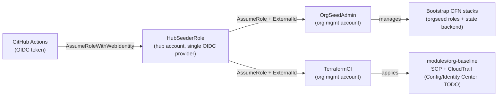

# aws-orgseed

[](https://github.com/DustyStudy/aws-orgseed/actions/workflows/validate.yml)

Multi-org AWS account seeding via Terraform, bootstrapped with OIDC — no long-lived
credentials, no per-org identity provider sprawl.

## The problem

Terraform can't manage an AWS Organization until an IAM role trusted by your CI's
OIDC provider already exists in that org's management account. But you can't create
that role *with* Terraform, because you have no credentials yet. `aws-orgseed` solves
this two-phase bootstrap problem across an arbitrary number of orgs from one config
file and one CI pipeline.

## Architecture: hub-and-spoke OIDC

Instead of creating a GitHub OIDC identity provider in every org (N providers to
maintain, N trust policies to audit), `aws-orgseed` uses one hub account:



Each org's `OrgSeedAdmin`/`TerraformCI` trust only the hub role's ARN, further
scoped by a per-org `sts:ExternalId` (confused-deputy protection — see
`bootstrap/org-seeding-role.yaml`). `TerraformCI` is explicitly denied any IAM
action on either role or CloudFormation action on the bootstrap stacks, so it
can never widen its own permissions even if its guardrail-baseline policy is
broadened later.

**Phase 0 — bootstrap (CloudFormation).** Run once per org, using whatever initial
admin access you have (break-glass, root, or credentials from `orgctl`). Deploys:
- `OrgSeedAdmin` role — scoped to managing the two bootstrap CFN stacks
  (this role/state-backend) — never used for application changes
- `TerraformCI` role — scoped to Terraform state access plus the Phase 1
  guardrail actions below, with an explicit `Deny` on touching the
  bootstrap roles/stacks (see the diagram note above)
- S3 state bucket (+ DynamoDB lock table, or S3-native locking)

**Phase 1 — ongoing (Terraform).** Once bootstrapped, further changes run as
normal Terraform, authenticated via OIDC through the same hub-role chain. No
static keys anywhere. `modules/org-baseline` currently implements a baseline
SCP (deny leaving the org, deny disabling CloudTrail/Config outside the CI
role, require IMDSv2, restrict root-user actions) and a multi-region,
KMS-encrypted CloudTrail trail with SNS notifications and CloudWatch Logs
integration (checkov's `CKV_AWS_35`/`CKV_AWS_252`/`CKV2_AWS_10`).

Two scope limits worth knowing before you rely on it:

- **SCPs never apply to the management account** - only to member accounts.
  Attaching the baseline to the root protects every member account and leaves
  the management account governed by IAM alone. Trial it on an OU first.
- **The trail is account-scoped by default** (`is_organization_trail = false`):
  it records the management account's own events, not member accounts'. Set it
  to `true` for an organization trail after enabling CloudTrail trusted access
  and the bucket policy for org delivery - see the variable's description.
  `enforce_imdsv2` (default `true`) blocks any `ec2:RunInstances` that doesn't
  require IMDSv2, including launch templates, ASGs and Karpenter; turn it off
  while you fix legacy launches. All of
those CloudTrail dependencies — the log bucket, KMS key, SNS topic, and
CloudWatch Logs group/delivery role — are expected to already exist
(managed by `aws-cloud-security-toolbox`/`aws-observability-dashboards`),
not created by this module; the delivery role specifically must be named
`orgseed-cwl-delivery-*` to match the scoped `iam:PassRole` grant in
`bootstrap/org-seeding-role.yaml`. Config baseline and IAM Identity Center
wiring are documented TODOs in that module rather than half-implemented
(`TerraformCI` already carries the permissions for both — see the module's
comments).

## Repo layout

```
bootstrap/                  CloudFormation — solves the chicken-and-egg problem
  oidc-provider.yaml          hub account only, created once
  org-seeding-role.yaml       deployed per target org (OrgSeedAdmin + TerraformCI)
  state-backend.yaml          per-org S3 state bucket + DynamoDB lock table
modules/                     Terraform, used after bootstrap
  org-baseline/                baseline SCP + optional CloudTrail; Config/Identity Center: TODO
stacks/
  baseline/                    Phase 1 root stack: the SCP, on ONE OU (never the root)
cli/
  seed.py                     orchestrates bootstrap across every org in orgs.yaml
  stack_inputs.py              renders the Phase 1 stack's backend + tfvars from the (secret) org config
  orgs.yaml                    declarative org list (accounts, regions, partitions)
  requirements.txt             runtime deps
  requirements-dev.txt         test-only deps (pytest)
tests/
  test_seed.py                 unit tests for seed.py (config validation, stack deploy logic, ExternalId)
  test_stack_inputs.py         the rendered backend/tfvars, masking, and state-key agreement with seed.py
  test_templates.py            structural tests for the bootstrap templates and the seed workflow
  test_terraform_workflow.py   pins the controls of the terraform workflow (two approvals, encrypted plan, ...)
examples/
  multi-org-example.yaml
.github/
  workflows/
    validate.yml               cfn-lint, checkov, tflint, ruff, bandit, pytest, terraform test
    seed.yml                    workflow_dispatch: runs cli/seed.py via OIDC (bootstrap stacks)
    terraform.yml               workflow_dispatch: plan / apply / destroy the Phase 1 stack via OIDC -> hub -> orgseed-ci
  actions/orgseed-session/     composite action: mask + render inputs, then chain hub -> orgseed-ci
```

## Phase 1: applying the guardrail SCP

`stacks/baseline` applies `modules/org-baseline`'s SCP to **one OU**, as the
`orgseed-ci` role, from the `terraform` workflow. It is deliberately incapable of
targeting the organization root (an SCP on the root hits every member account at
once, and only the management account can undo it) and of creating a CloudTrail
trail (that needs five resources provisioned elsewhere).

Add a `baseline:` block to the org's entry in the config (the base64 secret):

```yaml
orgs:
  - alias: sandbox
    ...
    baseline:
      scp_target_id: ou-xxxx-xxxxxxxx   # required - an OU, never r-xxxx
      enforce_imdsv2: true              # optional; stage off if you have legacy launches
```

Secrets in the `orgseed` Environment (the workflow needs, beyond `seed.yml`'s):
`ORGSEED_PLAN_KEY` - a random key that encrypts the plan between jobs
(`openssl rand -base64 36 | gh secret set ORGSEED_PLAN_KEY --env orgseed`).

Run **Actions -> terraform**, choosing the org alias and an action:

| action | what happens |
|---|---|
| `plan` | one approval, read-only: prints what would change (counts and resource addresses) |
| `apply` | plan -> **you review it** -> second approval -> applies *that plan file* |
| `destroy` | the same, for a destroy plan |

Two approvals is deliberate: the first lets a plan run, the second lets you apply
after reading it. The plan is passed between jobs **encrypted** (artifacts on a
public repo are downloadable by any signed-in GitHub user, and a plan embeds the OU
ID), and the apply job runs `terraform apply <planfile>`, never `-auto-approve`, so
it does exactly what was reviewed and refuses if state moved in between.

A shared, throwaway OU with a dedicated test account is the intended way to see the
SCP enforce before pointing it anywhere that matters.

## Quickstart

1. **Hub account.** Deploy `bootstrap/oidc-provider.yaml` once. An account can
   hold only one GitHub OIDC provider: if it already has one (another repo's
   bootstrap, an earlier setup), pass its ARN as `ExistingOidcProviderArn` and
   the stack reuses it instead of failing with `EntityAlreadyExists`.

   **Check which `sub` format GitHub emits for your repo** - a mismatch does not
   error, the hub role just can never be assumed:

   ```
   gh api repos/<owner>/<repo>/actions/oidc/customization/sub
   ```

   `use_immutable_subject: true` (the default for recently created repos) means
   tokens carry `repo:<owner>@<owner-id>/<repo>@<repo-id>:...`. The template
   defaults to that form and requires the two numeric IDs
   (`gh api repos/<owner>/<repo> -q '.owner.id, .id'`) as `GitHubOrgId` /
   `GitHubRepoId`; it refuses to deploy without them. Pinning exact IDs is
   stricter than a `@*` wildcard: a renamed, deleted or re-created repo can't
   impersonate this one. If yours is `false`, set `SubjectFormat=classic`.
2. **GitHub Environment.** Create an Environment named **`orgseed`** in the repo
   (Settings -> Environments), add required reviewers, and restrict it to the
   `main` branch. The hub role trusts only `environment:orgseed` by default
   (`AllowedRef`), so a push to `main` alone can't reach any org - the reviewer
   approval is the gate. Set the `orgseed` Environment **secret** `ORGSEED_HUB_ROLE_ARN` from the
   stack's `HubRoleArn` output (a secret, not a variable: the ARN contains the hub
   account ID, and a step's inputs are printed in the run log - variables in the
   clear, secrets masked).
3. **ExternalIds.** For each org generate a unique random value
   (`openssl rand -hex 24`), store it as an `orgseed` Environment secret
   (`ORGSEED_TRUST_<ALIAS>`), and map it in `.github/workflows/seed.yml`.
4. **Config.** Edit `cli/orgs.yaml` (see `examples/multi-org-example.yaml`).
   `ci_trust_ref` takes `env:NAME` so the value stays out of git; the shipped
   `CHANGE-ME-*` placeholder is refused at run time. To keep real account IDs
   and bucket names out of a public repo, store the whole config as an `orgseed`
   Environment **secret** named `ORGSEED_CONFIG`, base64-encoded:

   ```
   base64 -w0 my-orgs.yaml | gh secret set ORGSEED_CONFIG --env orgseed
   ```

   The seed workflow decodes it to a temp file and uses it instead of
   `cli/orgs.yaml`, and masks the account IDs and bucket names before `seed.py`
   can print them. A **secret, not a variable**: GitHub prints variables (and every
   step's `env`) in the clear in run logs - visible to anyone if the repo is public -
   but masks secrets. Base64 keeps it one line, because a multi-line secret is
   masked line by line. (For a local `--init`, point `--config` at a file outside
   the repo.)
5. **First run per org.** In each target org's management account, use existing
   break-glass/admin credentials and run
   `python cli/seed.py --init <alias>` - the one manual step that can't be
   automated away, by design. It deploys the roles and state-backend stacks and
   writes `cli/output/<alias>/backend.tf`.
6. **After that,** run the `seed` workflow (it pauses for reviewer approval) to
   re-apply the bootstrap stacks; Terraform for `modules/` authenticates via the
   same OIDC -> hub -> `orgseed-ci` chain. No static keys anywhere.

**Changing `AllowedRef` on an existing hub stack.** Earlier versions defaulted
it to `ref:refs/heads/main`. A job that declares `environment:` presents
`repo:<org>/<repo>:environment:<name>` as its subject, not the ref, so update the
hub stack's `AllowedRef` to `environment:orgseed` (or the `seed` workflow's
role assumption will be rejected).

## Proof

[`docs/PROOF.md`](docs/PROOF.md) is a report of running all of this for real against a real
AWS Organization: what was proven and how (with CloudTrail as the source of truth),
what breaking it for real found, what it does **not** prove, and how to reproduce it.
The machine-readable evidence is in [`docs/proof/`](docs/proof/).

## Testing

```
pip install -r cli/requirements.txt -r cli/requirements-dev.txt
pytest tests/ -v
```

`tests/test_templates.py` parses the bootstrap templates, the Terraform baseline
and the seed workflow and pins the properties that were once wrong (S3-native
lock release, Organizations' global region, the CloudTrail reads Terraform
needs, OIDC-provider reuse, the environment gate) - things cfn-lint and checkov
can't tell you are wrong *for how they're used*.

`tests/test_seed.py` covers `cli/seed.py`'s config validation, the
create/update/no-op branching in `deploy_stack()` (and its refusal to mistake
AccessDenied for a missing stack), `ExternalId` resolution and placeholder
rejection, `ExternalId` handling in `assume_role()`, and `backend.tf`
generation — using plain `unittest.mock` against the boto3 client rather than
a networked AWS mock, since `seed.py` is a thin orchestration layer over a
handful of calls.

## GovCloud

Every org entry declares its own `partition` (`aws` or `aws-us-gov`). The CLI and
CFN templates branch on this rather than inferring it, matching the GovCloud support
in `aws-cloud-security-toolbox` and the `fedramp-*-library` repos. The GovCloud entry
in `examples/multi-org-example.yaml` illustrates the wiring; validate it against a
real GovCloud account before relying on it — GovCloud has a few edges (STS regional
endpoints, service availability) worth confirming directly.

## License

MIT — see [LICENSE](LICENSE).
